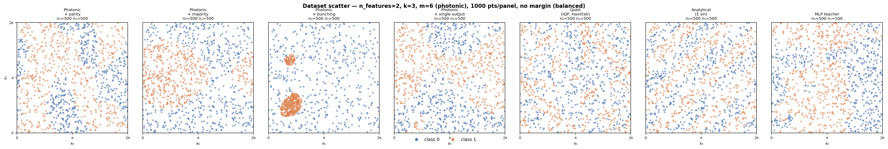
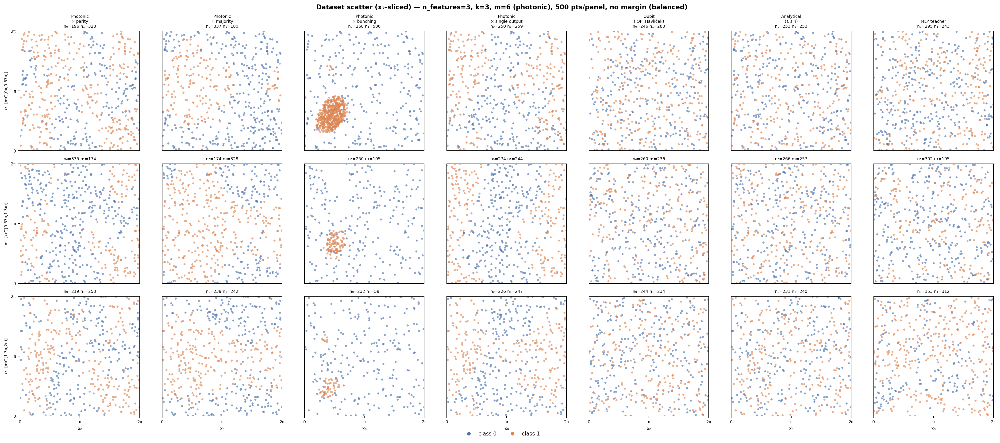
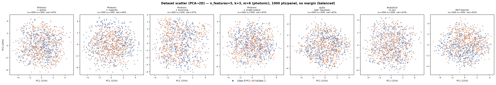

# Quantum vs Classical Learning Benchmark

A benchmark that trains three learner architectures — a classical MLP, a
photonic variational circuit, and a qubit variational circuit — on data
generated by four different teacher strategies, and finds the minimum model
size needed to reach 90% accuracy.

This work re-implements and extends the landmark paper:

> Havlíček, Córcoles, Temme, Harrow, Kandala, Chow, Gambetta.
> *Supervised learning with quantum-enhanced feature spaces.*
> **Nature 567, 209–212 (2019)** — [arXiv:1804.11326](https://arxiv.org/abs/1804.11326)

### What the original paper actually does — and what it leaves open

The paper introduces a 2-qubit IQP feature map and trains a variational
classifier on a synthetic dataset of **20 training + 20 test samples**, generated
by the same quantum circuit used as the learner (i.e. the dataset is, by
construction, perfectly learnable by the model). The reported 100% test accuracy
is therefore a self-consistency check, not a generalization result.

Two important questions are **not addressed** in the original paper:

1. **Classical learnability.** No classical baseline (MLP, SVM, …) is reported on
   the same dataset. It is unknown whether a simple classical model could learn the
   same boundary equally well — a gap that has since been discussed extensively in
   the quantum ML literature (e.g. Kübler et al. 2021, Schreiber et al. 2023).

2. **Scaling.** The 2-qubit / 20-sample setting is far below any practically
   relevant regime. Whether the quantum advantage (if any) persists as the feature
   dimension, dataset size, and model depth grow is left open.

This benchmark addresses both gaps by:
- Crossing quantum and classical learners with quantum and classical generators
  (off-diagonal cells directly probe classical learnability of quantum-generated data).
- Working at `m = 6–8` modes / `5–7` features with `5 000–10 000` filtered samples.
- Measuring the **minimum model size** to reach 90% rather than reporting a single
  accuracy on a hand-picked setting.

The original is qubit-based. We extend it to a **4 × 3 cross-evaluation grid**:

```
                          ┌─────────────── learner ───────────────┐
                          │  MLP    Photonic-quantum  Qubit-quantum│
   ┌──────────────────────┼───────────────────────────────────────┤
g  │ photonic_quantum     │   ●       photonic Havlíček    ●      │
e  │ qubit_quantum        │   ●              ●         paper setup │
n  │ analytical           │   ●              ●              ●     │
   │ mlp                  │ self-dist.        ●              ●     │
   └──────────────────────┴───────────────────────────────────────┘
```

Diagonal cells are sanity checks (each architecture learns its own teacher's decision boundary).
Off-diagonal cells test cross-architecture expressivity.

---

## Prerequisites

```bash
pip install -e .                     # install merlin
pip install perceval-quandela torch scikit-learn matplotlib
```

All scripts are run from the repository root with `work/` on the Python path:

```bash
cd /path/to/merlin-js
source venv/bin/activate
```

---

## Project layout

```
papers/quantum_feature_spaces/
├── train.py                       # unified training CLI
├── benchmark_6.py                 # full grid benchmark (m=8, k=4)
├── plot_data_generation.py        # unified dataset visualiser (n_features drives mode)
├── plot_photonic_observables.py   # photonic-only observable comparison across (m,k) configs
├── data/
│   ├── photonic_quantum.py    # Haar-unitary photonic teacher
│   ├── qubit_quantum.py       # IQP feature-map qubit teacher
│   ├── analytical.py          # closed-form pairwise-sin teacher
│   ├── mlp.py                 # random MLP teacher
│   └── _resample.py           # shared margin-filter / balance pipeline
└── learner/
    ├── photonic_quantum.py    # photonic RECTANGLE-MZI learner
    ├── qubit_quantum.py       # qubit IQP variational learner
    └── mlp.py                 # Fourier-feature MLP learner
```

---

## Quick start

### Single experiment

```bash
# Photonic learner on photonic-generated data, m=6, k=3
python papers/quantum_feature_spaces/train.py \
  --learner photonic_quantum --generator photonic_quantum \
  --m 6 --k 3 --balanced --min-margin 0.10 \
  --depths 1 2 3 --sizes 6 8 10 \
  --loss hloss --epochs 300

# Classical MLP learner on quantum data
python papers/quantum_feature_spaces/train.py \
  --learner mlp --generator photonic_quantum \
  --m 6 --k 3 --balanced --min-margin 0.10 \
  --hidden-sizes 64 "64,64" "128,128"

# SVM learner (RBF kernel + Fourier features) on quantum data
python papers/quantum_feature_spaces/train.py \
  --learner svm --generator photonic_quantum \
  --m 6 --k 3 --balanced --min-margin 0.10 \
  --C-values 0.1 1 10 100

# Qubit learner on qubit-generated data (paper setting)
python papers/quantum_feature_spaces/train.py \
  --learner qubit_quantum --generator qubit_quantum \
  --m 6 --k 3 --balanced --min-margin 0.30 \
  --depths 1 2 3 4

# Photonic learner with majority observable, 2 features on a 6-mode circuit
python papers/quantum_feature_spaces/train.py \
  --learner photonic_quantum --generator photonic_quantum \
  --m 6 --k 3 --n-features 2 --observable majority \
  --balanced --min-margin 0.10 --depths 1 2 3
```

### Full grid benchmark

```bash
python papers/quantum_feature_spaces/benchmark_6.py             # runs all 12 cells in parallel
python papers/quantum_feature_spaces/benchmark_6.py --dry-run   # preview commands without running
```

Logs are saved to `/tmp/bench_<learner>_<generator>.log`.

---

## `train.py` — reference

```
python papers/quantum_feature_spaces/train.py --learner LEARNER --generator GENERATOR [options]
```

### Problem definition

| Argument | Default | Description |
|---|---|---|
| `--m` | 6 | Number of optical modes (photonic) / qubit count (qubit) |
| `--k` | 3 | Complexity parameter (photons / teacher layers / Fourier freq.) |
| `--target-accuracy` | 0.90 | Stop search when this test accuracy is reached |

### Photonic generator / learner options

| Argument | Default | Description |
|---|---|---|
| `--observable` | `parity` | Photonic teacher observable: `parity`, `majority`, `bunching` (see below) |
| `--n-features` | `m-1` | Input feature dimension. Decouples encoding dim from circuit size. |

### Learner architecture

| Argument | Default | Description |
|---|---|---|
| `--learner` | `mlp` | `mlp`, `svm`, `photonic_quantum`, or `qubit_quantum` |
| `--depths` | `[1,2,3]` | (quantum) List of interferometer depths to try |
| `--sizes` | `[m]` | (photonic) List of circuit mode counts to try |
| `--hidden-sizes` | — | (MLP) Hidden layer specs, e.g. `64 "64,64" "128,64,32"` |
| `--C-values` | `[0.01,0.1,1,10,100,1000]` | (SVM) Regularisation values to sweep |
| `--svm-kernel` | `rbf` | (SVM) Kernel type: `rbf`, `linear`, `poly`, `sigmoid` |
| `--fourier-order` | `3` | (SVM) Fourier expansion order applied before the kernel (0 = raw) |

### Data generation

| Argument | Default | Description |
|---|---|---|
| `--generator` | `photonic_quantum` | `photonic_quantum`, `qubit_quantum`, `analytical`, or `mlp` |
| `--dataset-size` | 10000 | Target number of samples (post-filter, post-balance) |
| `--balanced` | off | Enforce 50/50 class balance |
| `--min-margin` | 0.20 | Drop samples with confidence below this value |
| `--bail-threshold` | 0.30 | Abort if first-batch yield is below this fraction; use `0` to always iterate |
| `--max-resample-iter` | 10 | Maximum resampling iterations |
| `--data-seed` | 42 | Random seed for data generation |

### Training

| Argument | Default | Description |
|---|---|---|
| `--loss` | `ce` | `ce` (cross-entropy), `hloss` (Havlíček BCE+bias), `mse` (soft regression, quantum generators only) |
| `--epochs` | 300 | Maximum epochs (or function evaluations for black-box optimisers) |
| `--lr` | auto | Learning rate (3e-3 for MLP, 1e-2 for quantum) |
| `--batch-size` | 64 | Mini-batch size |
| `--optimizer` | `Adam` | `Adam`, `AdamW`, `SGD`, `SPSA`, `CMA`, `COBYLA`, `NelderMead`, `Powell` |
| `--early-stopping-patience` | 60 | Stop if no improvement for this many epochs |
| `--model-seed` | 0 | Random seed for model initialisation |

---

## Generators

### `photonic_quantum`

Teacher: `W1 (Haar) → phase-encode(x) → W2 (Haar)` run on Merlin + Perceval.

**Input state:** photons are distributed evenly across the interferometer via
`round(i * m / k)` for i in range(k).  This ensures all modes are reachable
(no "light-cone" gaps), e.g. m=6, k=3 → `[1,0,1,0,1,0]`.

**`n_features` decoupling:** the feature dimension is independent of the circuit
size.  Setting `n_features=2` with `m=6` encodes two phases on modes 0–1 while
using the full 6-mode Fock space for the measurement — a 2D input backed by a
richer quantum state.  Default: `n_features = m - 1`.

**Observables** (controlled by `--observable` / `observable=` parameter):

| Observable | Formula | Notes |
|---|---|---|
| `parity` (default) | soft = Σ_s P(s)·(−1)^{n_left(s)} | n_left = photons on first ⌈m/2⌉ modes |
| `majority` | soft = E[(n_left − n_right)/k] | n_left/right = photons on first/last m/2 modes; **requires even m** |
| `bunching` | soft = P(anti-bunched) − P(bunched) | anti-bunched ⟺ all photons in distinct modes (HOM interference) |
| `single_output` | soft = P(output=input_state) − P(output=reversed_input_state) | each term is a permanent-squared; difference oscillates near 0 with ~98% natural balance |

The first three observables aggregate over many Fock states (coarse functions of the distribution).
`single_output` focuses on just two specific Fock states — the injected input state and its
mode-reversal — whose probabilities are each an interference permanent that can oscillate at
higher spatial frequency than the aggregate observables.  This may produce finer-grained decision
boundaries, closer to what the qubit IQP feature map achieves via its quadratic cross-phase terms.

Label = sign(soft). Soft targets ∈ [−1, +1].

**Seed sensitivity:** Haar-random unitaries can cause class imbalance for certain
(observable, m, k, seed) combinations (HOM suppression of one class, or the
majority observable being systematically biased by one input state geometry).
Seed=2 works reliably for the tested configs `(m,k) ∈ {(4,2),(6,2),(6,3)}` with
all three observables.  Set `--data-seed 2` if you see near-zero yield after
`--balanced`.

Recommended `min_margin`: 0.05–0.10 for m=6 (the parity distribution is
concentrated near zero; the Havlíček 0.3 gap requires ~4σ here).

### `qubit_quantum`

Teacher: random variational circuit with the Havlíček IQP feature map.
This is the paper's exact setup. Labels: `sign(⟨Z⊗n⟩)`.

Recommended `min_margin`: up to 0.30 (the paper's value is directly applicable).

### `analytical`

Teacher: `sign(Σ_{i<j} sin(k·(x_i − x_j)))` — a deterministic closed-form boundary.
No randomness beyond the input `x`. Very fast to generate.

Recommended `min_margin`: 0.10–0.30.

### `mlp`

Teacher: a random-weight MLP with `k` tanh hidden layers of width `max(2(m−1), 8)`,
Xavier-initialised, taking Fourier features of `x` as input.
Soft targets: teacher softmax probabilities (also usable as regression targets with `mse`).

Recommended `min_margin`: ≤ 0.05.

---

## Dataset visualisation

### Unified visualiser: `plot_data_generation.py`

Shows all six generators/observables side by side.  Display mode is chosen
automatically from `--n-features`:

```
n_features = 2  → direct 2D scatter (x₀ vs x₁)
n_features = 3  → x₂-sliced: --n-slices rows, each showing x₀ vs x₁ for one x₂ bin
n_features ≥ 4  → PCA projection to 2D
```

Columns (fixed order): Photonic×parity | Photonic×majority | Photonic×bunching | Qubit | Analytical | MLP

**2D direct** (`n_features=2`, m=6, k=3, seed=2, balanced):



**3D x₂-sliced** (`n_features=3`, m=6, k=3, seed=2, balanced, 3 slices):



**PCA projection** (`n_features=5`, m=6, k=3, seed=2, balanced):



```bash
# 2D direct (commands used to generate the figures above)
python papers/quantum_feature_spaces/plot_data_generation.py \
  --n-features 2 --k 3 --m 6 --seed 2 --size 1000 --balanced \
  --save papers/quantum_feature_spaces/img/observable_2d.png --no-show

# 3D sliced (3 x₂ bins, 500 pts/panel → 1500 total per generator)
python papers/quantum_feature_spaces/plot_data_generation.py \
  --n-features 3 --k 3 --m 6 --seed 2 --size 500 --balanced --n-slices 3 \
  --save papers/quantum_feature_spaces/img/observable_3d_sliced.png --no-show

# High-dimensional via PCA
python papers/quantum_feature_spaces/plot_data_generation.py \
  --n-features 5 --k 3 --m 6 --seed 2 --size 1000 --balanced \
  --save papers/quantum_feature_spaces/img/observable_pca.png --no-show
```

Key options:

| Option | Default | Description |
|---|---|---|
| `--n-features N` | (required) | Input dimension; must be ≤ m-1; controls display mode |
| `--k K` | 3 | Photons (photonic) / depth-complexity (others) |
| `--m M` | auto | Photonic circuit modes only (≥ n_features+1, preferably even) |
| `--n-slices S` | 3 | x₂ bins for 3D mode |
| `--size N` | 1000 | Target points per visual panel |
| `--seed S` | 2 | RNG seed (seed=2 works well for all observables) |
| `--save PATH` | — | Save figure to file |

### Photonic observable comparison: `plot_photonic_observables.py`

Compares parity / majority / bunching observables across multiple (m, k) configs.

```bash
# 2D direct, three (m,k) configurations
python papers/quantum_feature_spaces/plot_photonic_observables.py --seed 2

# 3D sliced for a single (m, k) config
python papers/quantum_feature_spaces/plot_photonic_observables.py \
    --n-features 3 --configs 6,3 --n-slices 3 --seed 2
```


---

## Key findings

- **Depth is the dominant capacity factor** for photonic learners: depth 1–2
  plateaus around 73–82%, depth 3–4 unlocks 85–90%+.
- **Circuit size (m_circuit) matters most at high depth.** At depth=4:
  m=6 → 85%, m=8 → 88%, m=10 → 90% for the quantum/quantum cell.
- **`mse` loss (soft regression) is much stronger than `hloss`** when the
  generator provides continuous parity targets. At m=6, depth=1:
  `mse` reaches 100% while `hloss` plateaus at ~73%.
- **`min_margin` is critical for photonic data (and probably others).** Without filtering,
  ~63% of samples lie near the decision boundary and dominate the loss
  with near-zero gradient signal. Setting `min_margin=0.10` (≈1.4σ)
  makes the problem cleanly learnable at depth=1.
- **Evenly-spaced input state matters.** Injecting photons as `round(i*m/k)` rather
  than front-loading them (`[1,1,...,0,0]`) ensures all modes of the interferometer
  are within the "light cone" of the input, preventing modes from being decorrelated
  from the data encoding.
